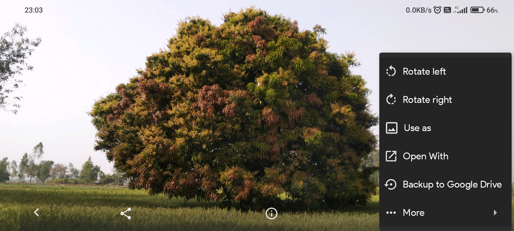
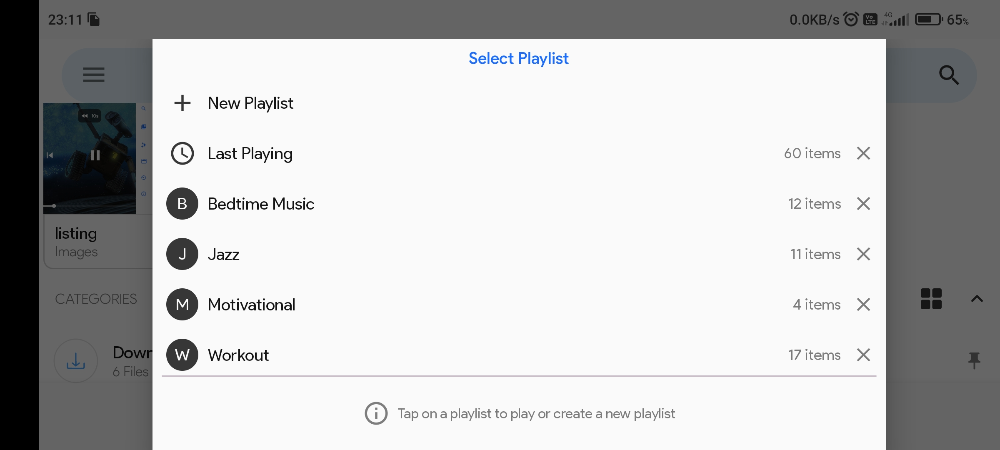

# RFM: File Manager and Media Player
#### RFM is a modern, powerful and customisable file manager and media player that lets you easily clean, explore and manage files on your device

#### Inspired by the Windows FIle Explorer
###### See also
[3D N*N Rubik's Cube solver-AI](https://github.com/ChauhanRohan-RC/Cube.git)  
[Fourier Series Simulation](https://github.com/ChauhanRohan-RC/Fourier-Series.git)  
[RSA Encryptor](https://github.com/ChauhanRohan-RC/RSA-Encryptor.git)

## Release

* Install the latest build from [Google Play Store](https://play.google.com/store/apps/details?id=com.rc.rfm)  
* See [Developer Page](https://play.google.com/store/apps/dev?id=7315303590538030232) 

## ✓ Clean

  
  

* Scan the device for
  * junk and temp files, app caches, logs etc
  * duplicate files scan using MD5 and SHA-256 hash function,
  * large files, old downloads and media files 
* Storage usage analytics
* Customize clean up algorithms in settings

## ▶ Play

  

* MEDIA PLAYER: Play videos and music with advance and stunning media player. 
  * Shuffle, repeat, toggle video
  * lock orientation, resize, swipe gestures
  * tracks and external subtitles, resume last playback 
  * playback speed, equalizer, backup, encrypt etc 
  * Background with Picture-in-Picture (PIP) mode playback  
* GALLERY: Explore and manage images with advance options
  * lossless subsampling zoom, rotate 
  * backup to cloud, pin bookmark, encrypt etc  

  

* PLAYLISTS: Save media queue in playlists. 
  * Play music and videos together. 
  * Search, reorder and manage saved playlists with duplicates warning 
  * Like-dislike Playlist. Reserved playlist for recently played media 

  

## 📌 Organise

Stay clean and organised with
* `CATEGORIES`
  * Downloads
  * Images
  * Music files
  * Videos 
  * Playlists
  * Documents
  * Apps
  * Custom Categories with `regex` pattern compiler
* `COLLECTIONS` 
  * Recent files
  * Encrypted Folder
  * Recycle Bin
  * Bookmarks
  * History  
* `Accessibilty`: Many layout and view options. Pin tiles on home screen for easy access  

# 🔒 Encrypt

* Encrypt folders and files using an advance encryption algorithm (RSA)
* Use a pin for authorizing access to the encrypted folder
* Lock's in automatically when someone tries to gain unauthorized access

  
  
  

## 🔍 Search

* Search anywhere with just one tap  
* Live search with smart and customizable search algorithm that lets you find files easily  
* Search files within a folder by tapping on folder name  
* CONTROL how search algorithm scan files, with advance options like Regular Expressions, Character and Case matching, Path analysis etc  
* CUSTOM CATEGORIES: Custom search UI, that lets you categorize and easily browse folders and files (as albums), based on a custom search pattern  

  
  

## 📁 Explore

* `COMPRESS` and `EXTRACT` files with ease with in-built file compressor and extractor  
* `TRASH`: Instead of permanently deleting, move files to trash and restore them in need  
* `BOOKMARKS`: Pin frequently visited folders and files to quickly access them later  
* `HISTORY`:  Keep track of browsed files. You can pause or clear it anytime  
* `RECENT FILES`: Access newly created or modified files in one place  
* `PROPERTIES`: Modern storage and file information with META DATA support like resolution, media location, frame rate, album, artist, app permissions and much more…  
* `SWIPE ACTIONS`: Swipe on a folder/file to perform quick actions. You can also customize it in settings  
* `MULTILEVEL SELECTIONS`: Select folders and files from multiple folders at the same time. It allows you to explore folders and files even in selection mode. No need to clear current selections in order to select from another folder…  
* `SHORTCUTS`: Pin folders and files on home screen for one-tap access  
* `SORT` and `FILTER`: Advance sorting and filtering options that allows you to browse files however you like  
* `Stack Navigation`: Breeze through the folders and drives easily like on pc  
* `I/O`: Fast and secure copy, move and delete algorithms that gives you full control over error handling (options like Overwrite, Resolve, Skip or Auto). Keep working with background copy/move support  
* `AI`: Rename files, create new files, folders and even chain of folders with auto suggestions and error handling  
* `ADVANCE OPTIONS`: File checksums, storage and folder analysis, encryption, backup to cloud etc  

## ⚙ Settings

* Configure look and feel of the app. Supports Dark Theme with automatic theme switching  
* Customise app behaviour (Core, Explorer, Media, Search, Cleaner and Collections), I/O (Copy, Encrypt, Trash, Backup etc), scan algorithms and almost everything  
* Information about core features is included in settings  

  

# Make app your own!

## Connect on
[Github](https://github.com/ChauhanRohan-RC/)  
[Google Play Store](https://play.google.com/store/apps/dev?id=7315303590538030232)
[Twitter](https://twitter.com/0rc_studio)  
[Youtube](https://www.youtube.com/channel/UCmyvutGWtyBRva_jrZfyORA)   
E-mail: com.production.rc@gmail.com

